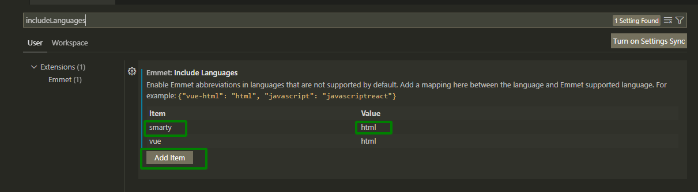
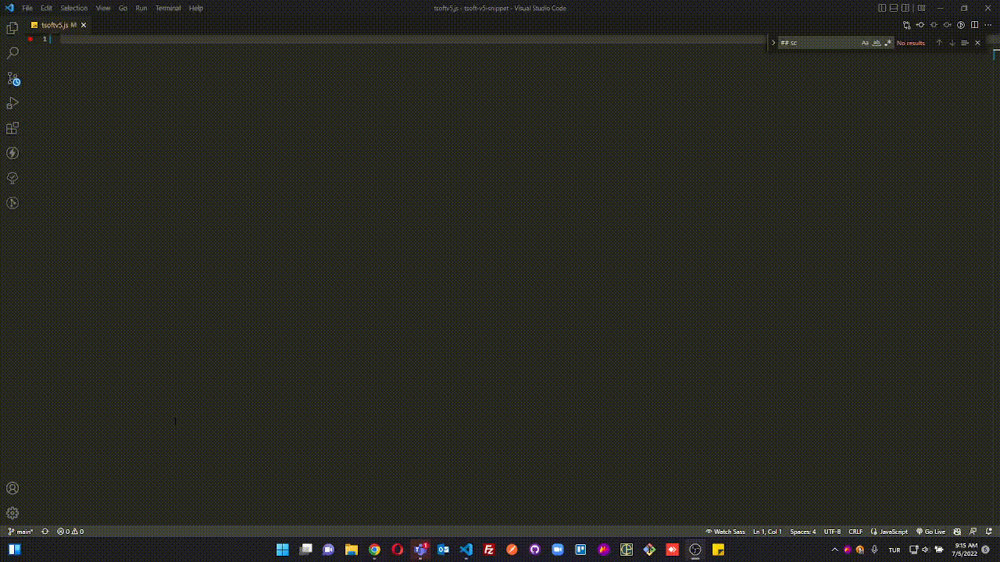
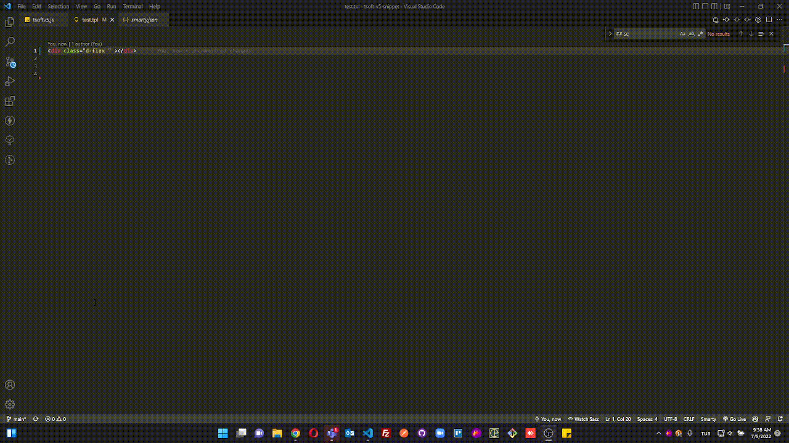
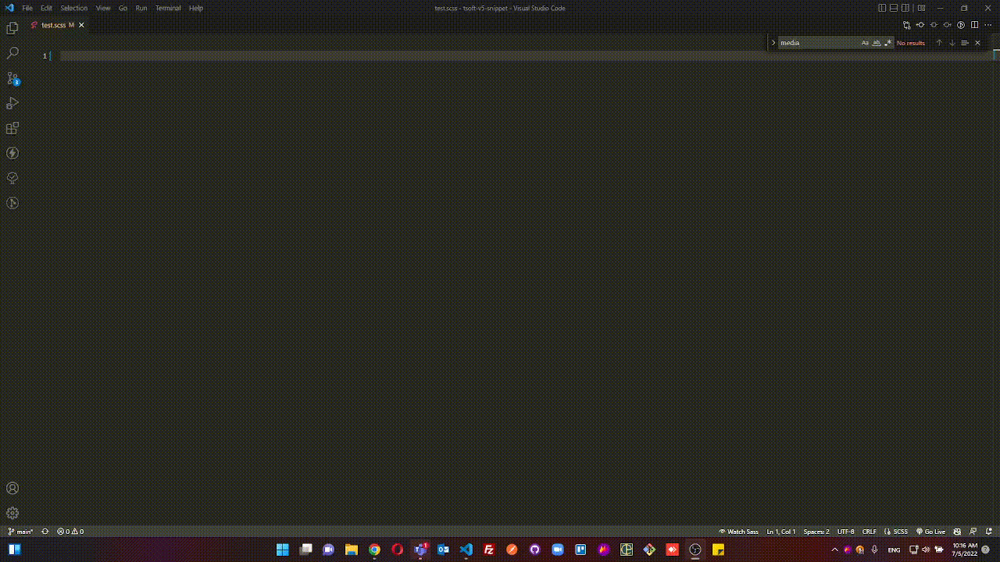

# Tsoft E-commerce V5 snippets
Javascript, smarty (.tpl) and scss snippets
The aim of this extention is to help  [tsoft.com.tr](https://www.tsoft.com.tr/) and [tsoftecommerce.com](https://www.tsoftecommerce.com/) frontend developers.


## ADVICES TO BE DONE BEFOREHAND
1. To have a better syntax highligting in <code> .tpl </code> files,  it is adviced to install [Smarty Template Support](https://marketplace.visualstudio.com/items?itemName=aswinkumar863.smarty-template-support) beforehand.

2. For Emmet Abbreviations you can paste the following into your settings.json file (press <code>F1</code>, then search <code>Open Settings (JSON)</code>)

  #### `F1 + > Open Setting (JSON) ⇥`  
```jsonc title="Örnek kullanım" 
"emmet.includeLanguages": {
  "smarty": "html"
}
```
==
or you can write <code> includeLanguages </code> in the setting input field and add item => "smarty" and value =>"html". 




## SNIPPET PREFIXES

<details id="JAVASCRIP">
  <summary>JAVASCRIPT V5</summary>
  <p>Here is Javascript code snippets for tsoftecommerce.com V5.


  #### `ON_PAGE_READY ⇥`  
```javascript title="Örnek kullanım" 
ON_PAGE_READY.push(()=>{
//alt şablonlardaki js işlemleri bu fonksiyon içine yazılmalıdır
    
})
```
  #### `cl ⇥`  
```javascript title="Örnek kullanım" 
console.log();
```
  #### `cv ⇥`  
```javascript title="Örnek kullanım" 
console.log('variable',variable);
```
  #### `ael ⇥`  
```javascript title="Örnek kullanım" 
selector.addEventListener("click",e=>{
    console.log(e)
});
```
  #### `docready ⇥`  
```javascript title="Örnek kullanım" 
document.addEventListener("DOMContentLoaded",e=>{
    console.log(e)
});
```
  #### `vuecreateapp ⇥`  
```javascript title="Örnek kullanım" 
Vue.createApp(appName).mount('#appSelector');
```
  #### `vuescript ⇥`  
```javascript title="Örnek kullanım" 
window['appName'] = {
    data() {
        return {
            P:``,
        }
    },
}
Vue.creatApp(appName).mount(`#app-selector`);
```
  #### `tsubmitform ⇥`  
```javascript title="Örnek kullanım" 
T(`#selector`).on('submit', e => {
    e.stopPropagation();
    e.preventDefault();
    const formEl = e.target;
    if(!T.checkValidity(formEl))
        return;
    var data = new FormData(formEl);
    axios.post('/srv/service/servicepath', data).then(response => {
        const result = response.data;
        console.log('result:', result);
        formEl.reset();
        T.notify({
            text:"element",
            className: 'success',
            duration: 3200
        });
    });
});
```
  #### `newswiper ⇥`  
```javascript title="Örnek kullanım" 
new Swiper(selector, {
    slidesPerView: 2,
    spaceBetween: T.isMobile() ? 8 : 15,
    navigation: {
        nextEl: `#swiper-next-${BLOCK.ID}`,
        prevEl:`#swiper-prev-${BLOCK.ID}`,
    },
    pagination: {
        el: '.swiper-pagination',
        clickable: true
    },
    breakpoints: {
        576: {
            slidesPerView: 3
        },
        768: {
            slidesPerView: 4
        }
    }
});
```
  #### `axiosget ⇥`  
```javascript title="Örnek kullanım" 
axios.get("url").then((res)=> {
    console.log(res.data);
})
.catch((error)=> {
    console.log(error);
})
```
  #### `axiospost ⇥`  
```javascript title="Örnek kullanım" 
axios.post("url", formData).then((res)=> {
    console.log(res.data);
})
.catch((error)=> {
    console.log(error);
})
```
  #### `fetchget ⇥`  
```javascript title="Örnek kullanım" 
fetch("users.json").then(res=> res.json())
.then(data=> {
        data.forEach(el => {
        console.log(el);
    });
})
.catch(err => console.log(err))
```

  
  #### `tcartcallback ⇥`  
```javascript title="Örnek kullanım" 
Cart.callback.add.push((res)=>{
        console.log(res) 
})
```
  #### `tready ⇥`  
```javascript title="Örnek kullanım" 
T.ready(function(){
    
})
```
  #### `tisEmptyObject ⇥`  
```javascript title="Örnek kullanım" 
T.isEmptyObject(obj)
```

  
  #### `teach ⇥`  
```javascript title="Örnek kullanım" 
T.each(T(`div`),(i, el)=>{
    console.log(i, el);
});
```
  #### `tsetCookie ⇥`  
```javascript title="Örnek kullanım" 
T.setCookie(cookieName, cookieValue, exdays) 
```
  #### `tgetCookie ⇥`  
```javascript title="Örnek kullanım" 
T.getCookie(cookieName) 
```
  #### `tblock ⇥` BLOCK
```javascript title="Örnek kullanım" 
BLOCK.
```
  #### `tsetting ⇥` SETTING
```javascript title="Örnek kullanım" 
SETTING.
```
  #### `timage ⇥` IMAGE
```javascript title="Örnek kullanım" 
IMAGE.
```
  #### `tgetlink ⇥` 
```javascript title="Örnek kullanım" 
T.getLink(`param`,'value','link');
```
  #### `tpopshow ⇥` 
```javascript title="Örnek kullanım" 
popoverAlert.show(
    T(`selector`)[0], msg, false, `btn btn-danger text-left`, true, `inline`
);
```
  #### `tpophide ⇥` 
```javascript title="Örnek kullanım" 
popoverAlert.hide(item, [`btn`, `btn-outline-danger`, `text-left`]);
```
#### `tpophideall ⇥` 
```javascript title="Örnek kullanım" 
popoverAlert.hideAll();
```
#### `tloadSubFolder ⇥` 
```javascript title="Örnek kullanım" 
loadSubFolder({
    pageId: 1,
    blockParentId: 1000,
    subFolder: 'subfoldername',
    params: { oneparam: oneparam, twoparam: twoparam },
    success:  function(loadRes){
        T.modal({ html: loadRes, width:'480px' });
        evalScripts(loadRes)
    }
});
```
#### `tisMobile ⇥` 
```javascript title="Örnek kullanım" 
T.isMobile()
```
#### `tgetUrlParam ⇥` 
```javascript title="Örnek kullanım" 
getUrlParam('param')
```
#### `tscrollToElm ⇥` 
```javascript title="Örnek kullanım" 
scrollToElm(`[href='#id']`);
```
#### `tlocalApi ⇥` 
```javascript title="Örnek kullanım" 
LocalApi.get(`key`);
```
#### `tevalScripts ⇥` 
```javascript title="Örnek kullanım" 
evalScripts(content);
```
#### `ts ⇥` tselector
```javascript title="Örnek kullanım" 
T(`selector`);
```
#### `twrap ⇥` 
```javascript title="Örnek kullanım" 
T.wrap(T(`toWrapSelector`)[0],'','classname');
```
#### `taddclass ⇥` 
```javascript title="Örnek kullanım" 
T(`selector`).addClass('active');
```

#### `tremoveclass ⇥` 
```javascript title="Örnek kullanım" 
T(`selector`).removeClass('active');
```
#### `ttoggleclass ⇥` 
```javascript title="Örnek kullanım" 
T(`selector`).toggleClass('active');
```
#### `thasclass ⇥` 
```javascript title="Örnek kullanım" 
T(`selector`).hasClass('active');
```
#### `tindex ⇥` 
```javascript title="Örnek kullanım" 
T(`selector`).index();
```
#### `tclick ⇥` 
```javascript title="Örnek kullanım" 
T(`#selector`).on(`click`, e => {
    e.stopPropagation();
    e.preventDefault();
    const el = e.target;
    
});
```
#### `toffclick ⇥` 
```javascript title="Örnek kullanım" 
T(`#selector`).off(`click`, e => {
    e.stopPropagation();
    e.preventDefault();
    const el = e.target;
    
});
```
#### `toneclick ⇥` 
```javascript title="Örnek kullanım" 
T(`#selector`).one(`click`, e => {
    e.stopPropagation();
    e.preventDefault();
    const el = e.target;
    
});
```
#### `ttrigger ⇥` 
```javascript title="Örnek kullanım" 
T(`selector`).trigger('click');
```

#### `thtml ⇥` 
```javascript title="Örnek kullanım" 
T(`selector`).html('element');
```
#### `ttext ⇥` 
```javascript title="Örnek kullanım" 
T(`selector`).text('text');
```
#### `theightset ⇥` 
```javascript title="Örnek kullanım" 
T(`selector`).height(400);
```
#### `theightget ⇥` 
```javascript title="Örnek kullanım" 
T(`selector`).height();
```
#### `tshow ⇥` 
```javascript title="Örnek kullanım" 
T(`selector`).show(`flex`);
```
#### `thide ⇥` 
```javascript title="Örnek kullanım" 
T(`selector`).hide();
```
#### `tnotify ⇥` 
```javascript title="Örnek kullanım" 
T.notify({
    text:`messageandtext`,
    className: `success`,
    duration: 3200,
    stopOnFocus: true,
    close: true,
    gravity:`top`,
    position: `left`,
    iconClass: `ti-thumbs-up`,
});
```
#### `tmodal ⇥` 
```javascript title="Örnek kullanım" 
T.modal({
    id: 'new-modal',
    class: `classname`,
    width: `480px`,
    title: `ModalTitle`,
    html: result.statusText,
    close: true,
    openCallback: () => {
    },
    closeCallback: () => {
    }
});
```
#### `tpublishingPopupCallback ⇥` 
```javascript title="Örnek kullanım" 
window.publishingPopupCallback=function(){
    
}
```
#### `ttooltip ⇥` 
```javascript title="Örnek kullanım" 
T.tooltip(T(`selector`)[0], {
    placement:`top`
});
```
#### `tcheckvalidity ⇥` 
```javascript title="Örnek kullanım" 
if(!T.checkValidity(e.target)) return;
```
#### `tpriceToFloat ⇥` 
```javascript title="Örnek kullanım" 
T.priceToFloat(strPrice);
```
#### `tvat ⇥` 
```javascript title="Örnek kullanım" 
T.vat(price, vat);
```

#### `tformat ⇥` 
```javascript title="Örnek kullanım" 
T.format(number);
```
#### `ttimeconverter ⇥` 
```javascript title="Örnek kullanım" 
T.timeConverter(1652702396000, `d.m.y`);
```

#### `tbuttonlock ⇥` 
```javascript title="Örnek kullanım" 
const button = T(`#form_submit_button`)[0];
T.buttonLock.dom = button;
T.buttonLock.tmp = button.innerHTML;
T.buttonLock.lock();
```
#### `tbuttonunlock ⇥` 
```javascript title="Örnek kullanım" 
T.buttonLock.unlock();
```

## Tsoft most used servives

#### `sretrunnotes ⇥` 
```javascript title="Örnek kullanım" 
`/srv/service/order-v4/order-return/${product_id}`
```
#### `svideo ⇥` 
```javascript title="Örnek kullanım" 
`/srv/service/gallery/video-detail/${product_id}`
```
#### `sfastlook ⇥` 
```javascript title="Örnek kullanım" 
`/srv/service/product-detail/view/606`
```
#### `sfolders ⇥` 
```javascript title="Örnek kullanım" 
`/srv/service/content/get/${BLOCK.ID}/folder_name`
```
#### `slanguage ⇥` 
```javascript title="Örnek kullanım" 
`/srv/service/language/change/${tr}`
```
#### `scurrency ⇥` 
```javascript title="Örnek kullanım" 
`/srv/shopping/shopping/set-currency/${tl}`
```

#### `scountry ⇥` 
```javascript title="Örnek kullanım" 
`/srv/shopping/shopping/set-country/${TR}`
```
#### `sproductlist ⇥` 
```javascript title="Örnek kullanım" 
`/srv/service/content/get-block/1003/category/${catID}`
```
#### `scatservice ⇥` 
```javascript title="Örnek kullanım" 
`/srv/service/category/get/${catID}`
```
#### `scatproduct ⇥` 
```javascript title="Örnek kullanım" 
`/srv/service/product/filter/category/${catID}?pg=1`
```
#### `sgettree ⇥` 
```javascript title="Örnek kullanım" 
`/srv/service/category/getTree/${catID}`
```
#### `sgetblock ⇥` 
```javascript title="Örnek kullanım" 
`/srv/service/content/get-block/1018/content/${içerik_id}`
```
#### `sinstallment ⇥` 
```javascript title="Örnek kullanım" 
`/srv/service/product-detail/credit-card-installment-list/${product_id}/${sub_product_id}`
```
#### `spaymentoptions ⇥` 
```javascript title="Örnek kullanım" 
`/srv/service/product-detail/payment-options/${product_id}/${sub_product_id}`
```
#### `scampaignproduct ⇥` 
```javascript title="Örnek kullanım" 
`/srv/campaign-v2/campaign/get-list-by-type/product/${product_id}`
```

#### `scampaigncart ⇥` 
```javascript title="Örnek kullanım" 
`/srv/campaign-v2/campaign/get-list-by-type/cart`
```
#### `scampaigncat ⇥` 
```javascript title="Örnek kullanım" 
`/srv/campaign-v2/campaign/get-list-by-type/category/${id}`
```

#### `scart ⇥` 
```javascript title="Örnek kullanım" 
`/srv/service/cart/load?link=sepet`
```
#### `scomment ⇥` 
```javascript title="Örnek kullanım" 
`/srv/service/product-detail/comments/${product_id}`
```
#### `scommentpoint ⇥` 
```javascript title="Örnek kullanım" 
`/srv/service/product-detail/comment-average/${product_id}`
```

#### `sbrand ⇥` 
```javascript title="Örnek kullanım" 
`/srv/service/filter/get/brands`

```
#### `srelatedblock ⇥` 
```javascript title="Örnek kullanım" 
`/srv/service/content/getBlock/1070/product/${product_id}`
```
#### `srelated ⇥` 
```javascript title="Örnek kullanım" 
`/srv/service/product/get-related-products/${product_id}/1`

```
#### `ssubstitution ⇥` 
```javascript title="Örnek kullanım" 
`/srv/service/product/get-related-products/${product_id}/2`
```

#### `saccessory ⇥` 
```javascript title="Örnek kullanım" 
`/srv/service/product/get-related-products/${product_id}/3`
```
#### `scomplement ⇥` 
```javascript title="Örnek kullanım" 
`/srv/service/product/get-related-products/${product_id}/4`
```


  
  </p>

</details>


<details id="SMARTY">
  <summary>SMARTY</summary>
  <p>
  Here is Smarty code snippets for tsoftecommerce.com V5.

  
#### `border- ⇥` 
```html title="Örnek kullanım" 
border-options
```
#### `fw- ⇥` 
```html title="Örnek kullanım" 
fw-options
```
 
#### `text- ⇥` 
```html title="Örnek kullanım" 
text-options
```
#### `btn- ⇥` 
```html title="Örnek kullanım" 
btn-options
```
#### `btn-outline- ⇥` 
```html title="Örnek kullanım" 
btn-outline-options
```
#### `bg- ⇥` 
```html title="Örnek kullanım" 
btn-outline-options
```
#### `pos-rd ⇥` 
```html title="Örnek kullanım" 
position-desktop-relative
```
#### `pos-sd ⇥` 
```html title="Örnek kullanım" 
position-desktop-sticky
```
#### `pos-ad ⇥` 
```html title="Örnek kullanım" 
position-desktop-absolute
```
#### `pos-fd ⇥` 
```html title="Örnek kullanım" 
position-desktop-fixed
```
#### `pos-r ⇥` 
```html title="Örnek kullanım" 
position-relative
```
#### `pos-s ⇥` 
```html title="Örnek kullanım" 
position-sticky
```
#### `pos-a ⇥` 
```html title="Örnek kullanım" 
position-absolute
```
#### `pos-f ⇥` 
```html title="Örnek kullanım" 
position-fixed
```
#### `column ⇥` 
```html title="Örnek kullanım" 
flex-direction-column
```
#### `row-f ⇥` 
```html title="Örnek kullanım" 
flex-direction-row
```
#### `row-r ⇥` 
```html title="Örnek kullanım" 
flex-direction-row-reverse
```
#### `wrap ⇥` 
```html title="Örnek kullanım" 
flex-wrap
```
#### `wrap-r ⇥` 
```html title="Örnek kullanım" 
flex-wrap-reverse
```
#### `shrink ⇥` 
```html title="Örnek kullanım" 
flex-shrink-options
```
#### `a-center ⇥` 
```html title="Örnek kullanım" 
align-items-center
```
#### `a-end ⇥` 
```html title="Örnek kullanım" 
align-items-flex-end
```
#### `a-start ⇥` 
```html title="Örnek kullanım" 
align-items-flex-start
```
#### `j-center ⇥` 
```html title="Örnek kullanım" 
justify-content-center
```
#### `j-between ⇥` 
```html title="Örnek kullanım" 
justify-content-between
```
#### `j-between ⇥` 
```html title="Örnek kullanım" 
justify-content-between
```
#### `j-around ⇥` 
```html title="Örnek kullanım" 
justify-content-around
```
#### `j-evenly ⇥` 
```html title="Örnek kullanım" 
justify-content-evenly
```
#### `j-start ⇥` 
```html title="Örnek kullanım" 
justify-content-flex-start
```
#### `j-end ⇥` 
```html title="Örnek kullanım" 
justify-content-flex-end
```
#### `container ⇥` 
```html title="Örnek kullanım" 
container-options
```
#### `extraformat ⇥` 
```html title="Örnek kullanım" 
{format price=($P.PRICE_SELL - ($P.PRICE_SELL * $P.NUMERIC1/100))}
```

  
#### `extraformat ⇥` 
```html title="Örnek kullanım" 
{format price=($P.PRICE_SELL - ($P.PRICE_SELL * $P.NUMERIC1/100))}
```

  
#### `extravat ⇥` 
```html title="Örnek kullanım" 
{vat price=($P.PRICE_SELL - ($P.PRICE_SELL * $P.NUMERIC1/100)) vat=$P.VAT}
```

  
  
#### `vuetemplate ⇥` 
```html title="Örnek kullanım" 
<div id="selector" class="row" v-cloak>
</div>

<script>
    const appName = {
        data() {
            return {
                
            }
        }
    };
    Vue.createApp(appName).mount('selector');
</script>
```
#### `IS_ADMIN_LOGGED ⇥` 
```html title="Örnek kullanım" 
IS_ADMIN_LOGGED
```
#### `IS_LAZY_LOAD_ACTIVE ⇥` 
```html title="Örnek kullanım" 
IS_LAZY_LOAD_ACTIVE
```
#### `IS_MEMBER_LOGGED_IN ⇥` 
```html title="Örnek kullanım" 
IS_MEMBER_LOGGED_IN
```
#### `IS_MOBILE ⇥` 
```html title="Örnek kullanım" 
IS_MOBILE
```
#### `IS_VENDOR ⇥` 
```html title="Örnek kullanım" 
IS_VENDOR
```
#### `LANGUAGE ⇥` 
```html title="Örnek kullanım" 
LANGUAGE
```
#### `LANGUAGE_SELECTED ⇥` 
```html title="Örnek kullanım" 
LANGUAGE_SELECTED
```
#### `LANGUAGE_LIST ⇥` 
```html title="Örnek kullanım" 
LANGUAGE_LIST
```
#### `IS_HTTPS_ACTIVE ⇥` 
```html title="Örnek kullanım" 
IS_HTTPS_ACTIVE
```
#### `FILTER_PROPERTY_LIST ⇥` 
```html title="Örnek kullanım" 
FILTER_PROPERTY_LIST
```
#### `IS_RECOMMENDATION_ACTIVE ⇥` 
```html title="Örnek kullanım" 
IS_RECOMMENDATION_ACTIVE
```
#### `SYMBOL_ ⇥` 
```html title="Örnek kullanım" 
SYMBOL_options
```
#### `LAZY_LOAD_LOADING_IMAGE ⇥` 
```html title="Örnek kullanım" 
LAZY_LOAD_LOADING_IMAGE
```
#### `DISPLAY_FAVOURITE_BUTTON ⇥` 
```html title="Örnek kullanım" 
DISPLAY_FAVOURITE_BUTTON
```
#### `DISPLAY_COMPARISON_BUTTON ⇥` 
```html title="Örnek kullanım" 
DISPLAY_COMPARISON_BUTTON
```
#### `DISPLAY_CART_BUTTON ⇥` 
```html title="Örnek kullanım" 
DISPLAY_CART_BUTTON
```
#### `DISPLAY_LANGUAGES ⇥` 
```html title="Örnek kullanım" 
DISPLAY_LANGUAGES
```
#### `CAMPAIGN_LIST ⇥` 
```html title="Örnek kullanım" 
CAMPAIGN_LIST
```
#### `CURRENCY_LIST ⇥` 
```html title="Örnek kullanım" 
CURRENCY_LIST
```
#### `data-toggle ⇥` 
```html title="Örnek kullanım" 
data-toggle="options"
```
#### `CURRENCY ⇥` 
```html title="Örnek kullanım" 
CURRENCY
```
#### `CHILDREN ⇥` 
```html title="Örnek kullanım" 
CHILDREN
```
#### `CHILDREN|@count ⇥` 
```html title="Örnek kullanım" 
CHILDREN|@count
```
#### `MEDIUM_WEBP_JPG ⇥` 
```html title="Örnek kullanım" 
MEDIUM_WEBP_JPG
```
#### `VARIANT_TYPE_ID ⇥` 
```html title="Örnek kullanım" 
VARIANT_TYPE_ID
```
#### `VARIANT_IDS ⇥` 
```html title="Örnek kullanım" 
VARIANT_IDS
```
#### `TITLE ⇥` 
```html title="Örnek kullanım" 
TITLE
```
#### `SMALL ⇥` 
```html title="Örnek kullanım" 
SMALL
```
#### `MEDIUM ⇥` 
```html title="Örnek kullanım" 
MEDIUM
```
#### `BIG ⇥` 
```html title="Örnek kullanım" 
BIG
```
#### `P ⇥` 
```html title="Örnek kullanım" 
P.options
```
#### `SUB ⇥` 
```html title="Örnek kullanım" 
SUB.options
```
#### `VARIANT_FEATURE1_LIST ⇥` 
```html title="Örnek kullanım" 
VARIANT_FEATURE1_LIST
```
#### `tsubfolder ⇥` 
```html title="Örnek kullanım" 
/srv/service/content-v5/sub-folder/{$PAGE_ID/{$BLOCK.PARENT_ID}/subfoldername/?product={$P.ID}&variant={$P.VARIANT_ID}
```
#### `tfor ⇥` 
```html title="Örnek kullanım" 
{for $i=1 to $P.STOCK}
$i
{/for}
```
#### `tvat ⇥` 
```html title="Örnek kullanım" 
{vat price=$P.PRICE_SELL vat=$P.VAT}
```
#### `tformat ⇥` 
```html title="Örnek kullanım" 
{format price=$P.PRICE_SELL}
```
#### `|string_format ⇥` 
```html title="Örnek kullanım" 
|string_format:'%.1f'
```
#### `|date_format ⇥` 
```html title="Örnek kullanım" 
|date_format:'Y,m,d,H,i,s'
```
#### `|strip_tags|escape ⇥` 
```html title="Örnek kullanım" 
|strip_tags|escape:'html'
```
#### `|strpos ⇥` 
```html title="Örnek kullanım" 
|strpos:''
```
#### `|default ⇥` 
```html title="Örnek kullanım" 
|default:''
```
#### `|replace ⇥` 
```html title="Örnek kullanım" 
|replace:'':''
```
#### `|count ⇥` 
```html title="Örnek kullanım" 
|@count
```
#### `| ⇥` 
```html title="Örnek kullanım" 
|options
```
#### `texchange ⇥` 
```html title="Örnek kullanım" 
{exchange price=$P.PRICE_SELL from=$P.TARGET_CURRENCY to='USD'}
```

#### `THEME_FOLDER ⇥` 
```html title="Örnek kullanım" 
THEME_FOLDER
```
#### `ASSETS ⇥` 
```html title="Örnek kullanım" 
ASSETS
```
#### `TABS ⇥` 
```html title="Örnek kullanım" 
TABS
```
#### `MENU ⇥` 
```html title="Örnek kullanım" 
MENUoptions
```
#### `titeration ⇥` 
```html title="Örnek kullanım" 
$smarty.foreach.name.iteration
```
#### `RELATED_PRODUCTS ⇥` 
```html title="Örnek kullanım" 
RELATED_PRODUCTS_IDS1_options
```
#### `SYMBOL_ ⇥` 
```html title="Örnek kullanım" 
SYMBOL_options
```
#### `ADDITIONAL_FIELD ⇥` 
```html title="Örnek kullanım" 
ADDITIONAL_FIELD_options
```
#### `NUMERIC1 ⇥` 
```html title="Örnek kullanım" 
NUMERIC1
```
#### `COUNTER ⇥` 
```html title="Örnek kullanım" 
COUNTER
```
#### `debugserver ⇥` 
```html title="Örnek kullanım" 
<pre>{$smarty.server|@debug_print_var}</pre>
```
#### `explode ⇥` 
```html title="Örnek kullanım" 
{assign var="CATARRAY" value=","|explode:$P.CATEGORY_IDS}
```
#### `inarray ⇥` 
```html title="Örnek kullanım" 
{in_array('20', array('10','20','30'))}
```
#### `mathsmarty ⇥` 
```html title="Örnek kullanım" 
{math assign="SEPETTUTARI" equation="x*((100+v)/100)*((100-y)/100)" x=$P.PRICE_SELL y=$P.ADDITIONAL_FIELD_1 v=$P.VAT}
```
#### `wame ⇥` 
```html title="Örnek kullanım" 
https://api.whatsapp.com/send?phone=9{$WHATSAPP_NO}&text=
```
#### `jsondecode ⇥` 
```html title="Örnek kullanım" 
json_decode($P.VARIANT_DATA, true)
```

#### `pid ⇥` 
```html title="Örnek kullanım" 
{$P.ID}
```
#### `bid ⇥` 
```html title="Örnek kullanım" 
BLOCK.ID
```
#### `jsvoid ⇥` 
```html title="Örnek kullanım" 
javascript:void(0)
```
#### `|substr ⇥` 
```html title="Örnek kullanım" 
|substr:0:5
```
#### `urlpage ⇥` 
```html title="Örnek kullanım" 
{url type='page' id='68'}
```
#### `predebug ⇥` 
```html title="Örnek kullanım" 
<pre>{arr|@debug_print_var}</pre>
```
#### `var_dump ⇥` 
```html title="Örnek kullanım" 
<pre>{$arr|@var_dump}</pre>
```
#### `editorfiles ⇥` 
```html title="Örnek kullanım" 
/Data/EditorFiles/v5images/
```
#### `debug ⇥` 
```html title="Örnek kullanım" 
{debug}
```
#### `/literal ⇥` 
```html title="Örnek kullanım" 
{debug}
```
#### `BLOCK ⇥` 
```html title="Örnek kullanım" 
BLOCK.options
```
#### `SETTING ⇥` 
```html title="Örnek kullanım" 
SETTING.options
```
#### `IMAGE ⇥` 
```html title="Örnek kullanım" 
IMAGE.options
```

## SERVICES 
#### `sretrunnotes ⇥` 
```html title="Örnek kullanım" 
/srv/service/order-v4/order-return/${$P.ID}
```
#### `ssearch ⇥` 
```html title="Örnek kullanım" 
/srv/service/order-v4/order-return/${$P.ID}
```
#### `svideo ⇥` 
```html title="Örnek kullanım" 
/srv/service/gallery/video-detail/${$P.ID}
```
#### `sfastlook ⇥` 
```html title="Örnek kullanım" 
/srv/service/product-detail/view/606
```
#### `sfolders ⇥` 
```html title="Örnek kullanım" 
/srv/service/content/get/block_id/folder_name
```
#### `slanguage ⇥` 
```html title="Örnek kullanım" 
/srv/service/language/change/tr
```
#### `scurrency ⇥` 
```html title="Örnek kullanım" 
/srv/shopping/shopping/set-currency/tl
```
#### `scountry ⇥` 
```html title="Örnek kullanım" 
/srv/shopping/shopping/set-country/TR
```
#### `sproductlist ⇥` 
```html title="Örnek kullanım" 
/srv/service/content/get-block/1003/category/catID
```
#### `scatservice ⇥` 
```html title="Örnek kullanım" 
/srv/service/category/get/catID
```
#### `scatproduct ⇥` 
```html title="Örnek kullanım" 
/srv/service/product/filter/category/catID?pg=1
```

#### `sgettree ⇥` 
```html title="Örnek kullanım" 
/srv/service/category/getTree/catID
```
#### `sgetblock ⇥` 
```html title="Örnek kullanım" 
/srv/service/content/get-block/1018/content/içerik_id
```
#### `sinstallment ⇥` 
```html title="Örnek kullanım" 
/srv/service/product-detail/credit-card-installment-list/${$P.ID}/${$P.VARIANT_ID}
```
#### `spaymentoptions ⇥` 
```html title="Örnek kullanım" 
/srv/service/product-detail/payment-options/${$P.ID}/${$P.VARIANT_ID}
```
#### `scampaignproduct ⇥` 
```html title="Örnek kullanım" 
/srv/campaign-v2/campaign/get-list-by-type/product/${$P.ID}
```
#### `scampaigncart ⇥` 
```html title="Örnek kullanım" 
/srv/campaign-v2/campaign/get-list-by-type/cart
```
#### `scampaigncat ⇥` 
```html title="Örnek kullanım" 
/srv/campaign-v2/campaign/get-list-by-type/category/id
```
#### `scart ⇥` 
```html title="Örnek kullanım" 
/srv/service/cart/load?link=sepet
```
#### `scomment ⇥` 
```html title="Örnek kullanım" 
/srv/service/product-detail/comments/${$P.ID}
```
#### `scommentpoint ⇥` 
```html title="Örnek kullanım" 
/srv/service/product-detail/comment-average/${$P.ID}
```
#### `sbrand ⇥` 
```html title="Örnek kullanım" 
/srv/service/filter/get/brands
```
#### `srelatedblock ⇥` 
```html title="Örnek kullanım" 
/srv/service/content/getBlock/1070/product/${$P.ID}
```
#### `srelated ⇥` 
```html title="Örnek kullanım" 
/srv/service/product/get-related-products/${$P.ID}/1
```
#### `ssubstitution ⇥` 
```html title="Örnek kullanım" 
/srv/service/product/get-related-products/${$P.ID}/2
```
#### `saccessory ⇥` 
```html title="Örnek kullanım" 
/srv/service/product/get-related-products/${$P.ID}/3
```

#### `scomplement ⇥` 
```html title="Örnek kullanım" 
/srv/service/product/get-related-products/${$P.ID}/4
```
#### `hover- ⇥` 
```html title="Örnek kullanım" 
block,inline-block,flex,inline-flex,none,hidden,visible,transition-none,scale,scale-lg,grayscale,grayscale-reverse,blur,blur-reverse,opacity,opacity-reverse,to-up,to-down,to-left,to-right,shadow,bg-transparent,text-primary,bg-primary,border-primary
```
#### `effect-w- ⇥` 
```html title="Örnek kullanım" 
effect-wrapper
```
#### `category f-w- ⇥` 
```html title="Örnek kullanım" 
{category id="{$TABLE_ID}" assign="MY_CATEGORY"} 
```
#### `product f-w- ⇥` 
```html title="Örnek kullanım" 
{product id="{$P.ID}" assign="MY_PRODUCT"}
```
#### `menu f-w- ⇥` 
```html title="Örnek kullanım" 
{menu key="MENU_FOOTER" assign="MENU_FOOTER"}
```


  </p>

</details>


<details id="SCSS">
  <summary>SCSS V5</summary>
  <p>Here is Scss code snippets for tsoftecommerce.com V5.


#### `transparentize ⇥`  
```scss title="Örnek kullanım" 
transparentize($bgPrimary, 0.5);
```
#### `darken ⇥`  
```scss title="Örnek kullanım" 
darken($bgPrimary, 10%)
```
#### `lighten ⇥`  
```scss title="Örnek kullanım" 
lighten($bgPrimary, 10%)
```
#### `$gridColumns ⇥`  
```scss title="Örnek kullanım" 
$gridColumns
```
#### `$gridPadding ⇥`  
```scss title="Örnek kullanım" 
$gridPadding
```
#### `$mobileGridPadding ⇥`  
```scss title="Örnek kullanım" 
$mobileGridPadding
```
#### `$xxlScreen ⇥`  
```scss title="Örnek kullanım" 
$xxlScreen
```
#### `$xlScreen ⇥`  
```scss title="Örnek kullanım" 
$xlScreen
```
#### `$lgScreen ⇥`  
```scss title="Örnek kullanım" 
$lgScreen
```
#### `$mdScreen ⇥`  
```scss title="Örnek kullanım" 
$mdScreen
```
#### `$smScreen ⇥`  
```scss title="Örnek kullanım" 
$smScreen
```


#### `$bg ⇥`  
```scss title="Örnek kullanım" 
$bgoptions
$bgBody
$bgPrimary
$bgSecondary
$bgWhite
$bgBlack
$bgGray
$bgLight
$bgDarkGray
$bgSuccess
$bgInfo
$bgWarning
$bgDanger
```
#### `$border ⇥`  
```scss title="Örnek kullanım" 
$borderoptions
$borderBody
$borderPrimary
$borderSecondary
$borderWhite
$borderBlack
$borderGray
$borderLight
$borderDarkGray
$borderSuccess
$borderInfo
$borderWarning
$borderDanger
$borderRadius

```
#### `$button ⇥`  
```scss title="Örnek kullanım" 
$buttonoptions
$buttonPrimary
$buttonSecondary
$buttonWhite
$buttonBlack
$buttonGray
$buttonLight
$buttonDarkGray
$buttonSuccess
$buttonInfo
$buttonWarning
$buttonDanger

```
#### `$text ⇥`  
```scss title="Örnek kullanım" 
$textoptions
$textPrimary
$textSecondary
$textWhite
$textBlack
$textGray
$textLight
$textDarkGray
$textSuccess
$textInfo
$textWarning
$textDanger
$textColor

```
#### `$headingColor ⇥`  
```scss title="Örnek kullanım" 
$headingColor

```
#### `$font ⇥`  
```scss title="Örnek kullanım" 
$fontoptions
$fontH1
$fontH2
$fontH3
$fontText
$fontMaster


```
#### `clamp ⇥`  
```scss title="Örnek kullanım" 
clamp(13px,1vw,20px)

```
#### `importsetting ⇥`  
```scss title="Örnek kullanım" 
@import "setting.scss";
@import "mixin.scss";

```
#### `i-mask ⇥`  
```scss title="Örnek kullanım" 
mask:url(#{$assets}/image_path);
mask-repeat: no-repeat;
mask-position: center;
mask-size: cover;
-webkit-mask:url(#{$assets}/image_path);
-webkit-mask-repeat: no-repeat;
-webkit-mask-position: center;
-webkit-mask-size: cover;
background-color:$bgPrimary;

```
#### `i-scrollbar ⇥`  
```scss title="Örnek kullanım" 
 @include scrollbar(5, 5, $bgPrimary);

```
#### `i-lineclamp ⇥`  
```scss title="Örnek kullanım" 
 @include line-clamp(2);

```
#### `i-j-evenly ⇥`  
```scss title="Örnek kullanım" 
  @include justify-content-evenly;

```
#### `i-j-center ⇥`  
```scss title="Örnek kullanım" 
  @include justify-content-center;

```
#### `i-j-start ⇥`  
```scss title="Örnek kullanım" 
 @include justify-content-flex-start;

```
#### `i-j-end ⇥`  
```scss title="Örnek kullanım" 
  @include justify-content-flex-end;

```
#### `i-j-between ⇥`  
```scss title="Örnek kullanım" 
  @include justify-content-between;

```
#### `i-j-around ⇥`  
```scss title="Örnek kullanım" 
   @include justify-content-around;

```
#### `i-a-end ⇥`  
```scss title="Örnek kullanım" 
  @include align-items-flex-end;

```
#### `i-a-start ⇥`  
```scss title="Örnek kullanım" 
  @include align-items-flex-start;

```
#### `i-row ⇥`  
```scss title="Örnek kullanım" 
   @include flex-direction-row;

```
#### `i-column ⇥`  
```scss title="Örnek kullanım" 
   @include flex-direction-column;

```
#### `i-wrap ⇥`  
```scss title="Örnek kullanım" 
   @include flex-wrap;

```
#### `i-flex ⇥`  
```scss title="Örnek kullanım" 
 @include d-flex;

```
#### `i-inlineflex ⇥`  
```scss title="Örnek kullanım" 
 @include d-inline-flex;

```
#### `i-allcenter ⇥`  
```scss title="Örnek kullanım" 
  @include d-flex;
  @include align-items-center;
  @include justify-content-center;

```
#### `i-block ⇥`  
```scss title="Örnek kullanım" 
  @include BLOCK {
  
  }

```
#### `boxshadow ⇥`  
```scss title="Örnek kullanım" 
box-shadow: 0 0 10px 0 rgb(40 40 40 / 30%);

```
#### `textshadow ⇥`  
```scss title="Örnek kullanım" 
text-shadow: 1px 1px 2px $bgBlack, 0 0 1em $bgBlack, 0 0 0.2em $bgBlack;

```
#### `lineclamp ⇥`  
```scss title="Örnek kullanım" 
display: -webkit-box !important;
-webkit-line-clamp: 2;
-webkit-box-orient: vertical;
overflow: hidden;

```
#### `mediamin ⇥`  
```scss title="Örnek kullanım" 
@media (min-width: $mdScreen){

}

```
#### `mediamax ⇥`  
```scss title="Örnek kullanım" 
@media (max-width: $mdScreen - 1){

}

```
#### `keyframes ⇥`  
```scss title="Örnek kullanım" 
@keyframes mymove {
    from {top: 0px;}
    to {top: 200px;}
}

```


  </p>

</details>


## WHAT IT LOOKS LIKE







## Source
[MIT](https://github.com/gitorhub/tsoft-v5-snippet/blob/main/README.md)
## License
[MIT](https://github.com/gitorhub/tsoft-v5-snippet/blob/main/LICENCE)


- [JAVASCRIP](#JAVASCRIP)
- [SMARTY](#SMARTY)
- [SCSS](#SCSS)

